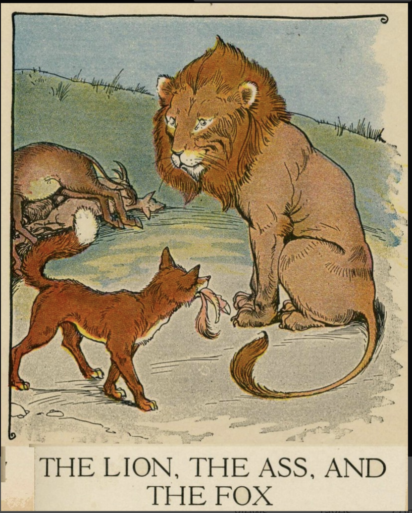

<h2> De Fabels van Aesop </h2>

<strong> 
 Update: Code being restructured and project expanded 
 </strong>
---

 ---------

In this notebook an analysis of some Aesop fables in dutch and german is conducted. It is mosty a sandbox of SpaCy using nl_core_new_lg model.  It analyzes tokens, lexical attributes, rule based matching, named entities, word vectors and semantic similarity a first glimpse oof pipelines processing among other.

